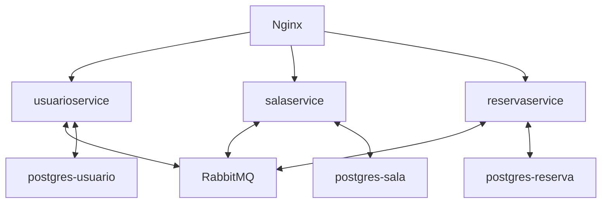

# Sistema de Reserva de Salas — Microservices Java + Spring Boot + Docker

Este projeto é uma arquitetura de microserviços para gerenciamento de reservas de salas, desenvolvido em Java com Spring Boot, mensageria com RabbitMQ, bancos PostgreSQL individuais por serviço e orquestração via Docker Compose. O gateway reverso é realizado com Nginx. Cada serviço roda de forma isolada e comunicam-se por REST e RabbitMQ.

---

## Sumário

- [Descrição do Projeto](#descrição-do-projeto)
- [Arquitetura dos Serviços](#arquitetura-dos-serviços)
- [Pré-requisitos](#pré-requisitos)
- [Como limpar e buildar os JARs](#como-limpar-e-buildar-os-jars)
- [Como rodar com Docker Compose](#como-rodar-com-docker-compose)
- [Testes](#testes)
- [Testando as APIs — Coleção Insomnia](#testando-as-apis---coleção-insomnia)
- [Como acessar o RabbitMQ Management](#como-acessar-o-rabbitmq-management)
- [Acessando o sistema](#acessando-o-sistema)
- [FAQ / Dúvidas Frequentes](#faq--dúvidas-frequentes)

---

## Descrição do Projeto

- **Domínio:** Reserva de salas por usuários em diferentes horários.
- **Serviços**:
  - **usuarioservice**: Cadastro e gerenciamento de usuários.
  - **salaservice**: Cadastro e gerenciamento de salas.
  - **reservaservice**: Criação e consulta de reservas.
- Cada microserviço possui seu próprio banco PostgreSQL.
- Comunicação por REST e mensageria (RabbitMQ) para integração desacoplada.
- Nginx como API Gateway/reverso.

---

## Arquitetura dos Serviços



---

## Pré-requisitos

- Docker e Docker Compose instalados
- Java 17+ e Maven (apenas se for buildar o JAR manualmente)
- 4GB+ RAM livre para rodar todos os containers

---

## Como limpar e buildar os JARs

Execute para cada microserviço:

```bash
cd usuarioservice
mvn clean package -DskipTests
cd ../salaservice
mvn clean package -DskipTests
cd ../reservaservice
mvn clean package -DskipTests
```

Os JARs gerados ficarão em `/target` de cada microserviço.

---

## Como rodar com Docker Compose

1. Certifique-se de que os JARs estão presentes em cada serviço.
2. No diretório raiz (onde está o `docker-compose.yml`):

```bash
docker-compose up --build -d
```

- Para parar:
```bash
docker-compose down -v
```

---

## Testes

Para rodar os testes de cada microserviço:

```bash
cd usuarioservice
mvn test
cd ../salaservice
mvn test
cd ../reservaservice
mvn test
```

---

## Testando as APIs — Coleção Insomnia

Uma coleção completa do Insomnia já está pronta para você testar todos os endpoints dos microserviços, incluindo exemplos de payload, autenticação e organização por serviço.

- **Arquivo da coleção Insomnia:** [`insomnia_microservices.json`](insomnia_microservices.json)
- **Como usar:**  
  1. Baixe o arquivo.
  2. No Insomnia, vá em `Import Data > From File` e selecione o JSON.
  3. Use as requisições prontas, já configuradas com autenticação básica (`admin` / `admin`).

Assim, você não precisa se preocupar em criar ou documentar manualmente cada endpoint — basta importar e começar a testar!

---

## Como acessar o RabbitMQ Management

- Acesse em [http://localhost:15672](http://localhost:15672)
- Usuário/padrão: **guest** / **guest**

---

## Acessando o sistema via Nginx

O Nginx fará o papel de reverso/API Gateway. Acesse os serviços pelos endpoints configurados em `nginx.conf`.

Por padrão (ajuste conforme seu nginx.conf):

- `http://localhost/api/salas`
- `http://localhost/usuarios`
- `http://localhost/reservas`

---

## FAQ / Dúvidas Frequentes

- **Não consigo conectar ao banco:** Certifique-se que os serviços postgres estão rodando e as variáveis de ambiente no `docker-compose.yml` estão corretas.
- **Como limpar tudo?** Use `docker-compose down -v` para remover containers e volumes.
- **Como alterar portas?** Altere o mapeamento de portas no `docker-compose.yml`.
- **Como testar as APIs?** Basta importar a coleção do Insomnia fornecida neste projeto!

---